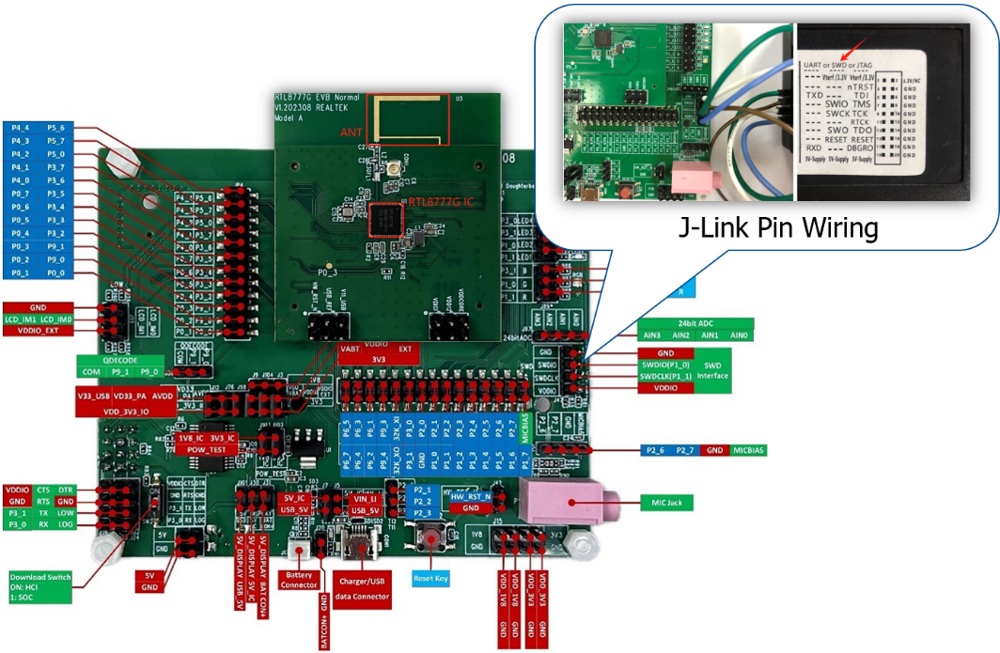
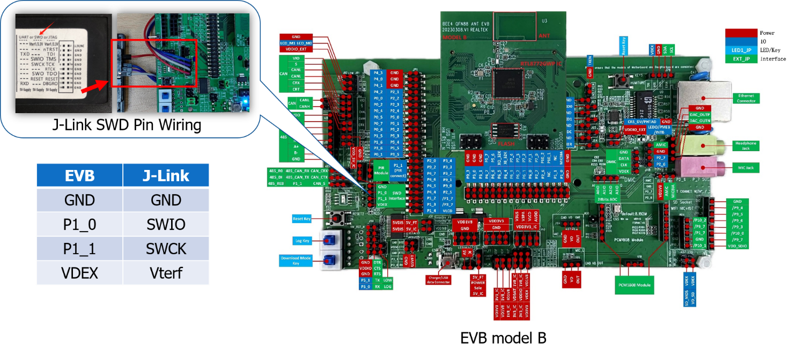
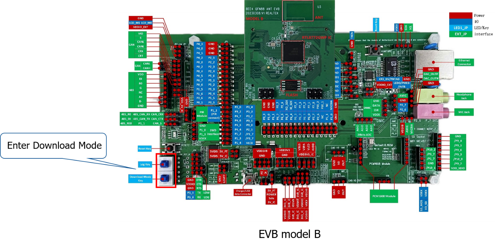

# Overview
Welcome to the Realtek Zephyr SDK guide.

This guide will instruct you on how to develop Zephyr applications with Realtek’s Bee SoCs.

The currently supported Realtek Bee SoC series for Zephyr
include the following:

-   RTL87x2G

Realtek Zephyr SDK contains three Github Repositories:

-   zephyr: forked from zephyrproject and contains Realtek's
    realization.

-   hal_realtek: hal module of Realtek's SoC.

-   realtek-zephyr-project: contains Realtek\'s applications developed
    based on zephyr.

All the repositories can be fetched from Realtek's github organization:
<https://github.com/rtkconnectivity>.

# Prerequisites

## Hardware Development Environment

For the detailed description about the RTL87x2G's hardware development
environment, please reference to [RTL87x2G's Hardware Development Environment](https://docs.realmcu.com/sdk/rtl87x2g/common/en/latest/doc/quick_start/text_en/README.html#hardware-development-environment).

## J-Link Setup

Since zephyr's original commands (west flash & west debug) are relying
on the J-link, so it is important to setup J-link correctly.

### J-Link Configuration

First of all, download the J-Link from the link:
<https://www.segger.com/downloads/jlink>. Make sure the version is
between **6.18 and 7.50**. Version 7.50 is highly recommended.

Second, go to the local J-Link installation directory. Typically, the
installation directory is located at:

-   Window: C:\\Program Files (x86)\\SEGGER\\JLink

-   MacOS: \~/Applications/SEGGER/JLink_VXXX

Then do these two steps:

1.  Under the directory \\Devices, create two levels of folders named
    Realtek\\RTL87X2G, and place the **RTL87X2G_FLASH.FLM** and
    **RTL87X2G.JLinkScript** under the RTL87X2G folder. The
    **RTL87X2G_FLASH.FLM** and **RTL87X2G.JLinkScript** files can be
    obtained from the **J-link-Settings_RTL87X2G.zip** archive.

2.  Add the information for RTL87x2G to the **JLinkDevices.xml** file
    located in the J-Link installation directory. You can directly copy
    and paste the code block provided below:

```html
\<Device\>
\<ChipInfo Vendor=\"Realtek\" Name=\"RTL87X2G\"
Core=\"JLINK_CORE_CORTEX_M33\" WorkRAMAddr=\"0x00130000\"
WorkRAMSize=\"0x8000\"
JLinkScriptFile=\"Devices/Realtek/RTL87X2G/RTL87X2G.JLinkScript\" /\>
\<FlashBankInfo Name=\"QSPI Flash\" BaseAddr=\"0x04000000\"
MaxSize=\"0x100000\" Loader=\"Devices/Realtek/RTL87X2G/
RTL87X2G_FLASH.FLM\" LoaderType=\"FLASH_ALGO_TYPE_CMSIS\"
AlwaysPresent=\"1\" /\>
\</Device\>
```

### J-Link Connection
The J-Link connection methods for EVB model A and B are shown in the below.


> J-Link Connection with EVB model A SWD interface



> J-Link Connection with EVB model B SWD interface

# Getting started with Command-line

Zephyr supports command-line development environment on Ubuntu, macOS
and Windows. This chapter will introduce how to get started quickly with
command-line using Realtek's evaluation board. Specifically, this
chapter includes:

1.  How to set-up the zephyr command-line development environment on
    your host machine.

2.  How to cross-compile and generate the zephyr binary image.

3.  How to download images into Realtek's evaluation board and test if
    you are running to the zephyr application.

## Zephyr Environment Setup

### Install dependencies

Please refer to [Install
dependencies](https://docs.zephyrproject.org/latest/develop/getting_started/index.html#install-dependencies).
Make sure you have installed all the dependencies:

| Tool                    | Min. Version |
|-------------------------|--------------|
| CMake                   | 3.20.5       |
| Python                  | 3.8          |
| Devicetree compiler     | 1.4.6        |
| Ninja                   | /            |
| Gperf                   | /            |
| Git                     | /            |
| wget                    | /            |
| 7zip                    | /            |

### Get Realtek Zephyr Package

Most of the steps in this section can be referenced from the [Get Zephyr
and install Python
dependencies](https://docs.zephyrproject.org/latest/develop/getting_started/index.html#get-zephyr-and-install-python-dependencies)
except the step \"**Get the Zephyr source code**\". Please use the
following instructions instead of the steps on \"**Get the Zephyr source
code**\" in the zephyr official getting-started guide.

**Windows:**

```
west init -m https://github.com/rtkconnectivity/realtek-zephyr-project
zephyr-rtk-project
```
```
cd zephyr-rtk-project
```
```
west update
```

**MacOS & Ubuntu:**
```
west init -m https://github.com/rtkconnectivity/realtek-zephyr-project ~/zephyr-rtk-project
```
```
cd ~/zephyr-rtk-project
```
```
west update
```

The difference is that you fetch the [Realtek Zephyr Package](https://github.com/rtkconnectivity/zephyr), instead
of the official Zephyr Package.

### Install a toolchain

The Zephyr Software Development Kit (SDK) contains toolchains for each
of Zephyr's supported architectures, which include a compiler,
assembler, linker and other programs required to build Zephyr
applications. Follow the instructions in [Install the Zephyr
SDK](https://docs.zephyrproject.org/latest/develop/getting_started/index.html#install-the-zephyr-sdk)
to install the toolchain.

## Configuration and build

Realtek Zephyr SDK uses Kconfig system to manage the configurations
among the drivers, applications, and kernel operation system.

The default configuration file defines the default properties of the
board target. All the default configuration files are placed in /boards
folder:

| Targets          | Location                                                 |
|------------------|----------------------------------------------------------|
| rtl8762gn_evb    | boards\\arm\\rtl8762gn_evb\\rtl8762gn_evb_defconfig      |

To demonstrate the configuration and build process, we take
rtl8762gn_evb and hello_world application for example. Please locate you
current directory to /zephyr-rtk-project/zephyr, and then run this:
```
west build -b rtl8762gn_evb samples/hello_world
```

Then, the target files zephyr.bin & zephyr.hex will be generated in
build/zephyr folder.

Optionally, if you want to customize your own configurations, run this
to activate the menuconfig.
```
west build -b rtl8762gn_evb -t menuconfig samples/hello_world
```


The UI of zephyr menuconfig

After configuring, you could save the configuration, exit and then run:
```
west build
```
The target files will be generated based on your own configurations.

## Image Download and Execution

### Burn essential images of RTL87x2G 

Before burning the zephyr image into flash, you need to burn five
essential images to make RTL87x2G work normally.


| Image             | Function                                                                                             |
|-------------------|------------------------------------------------------------------------------------------------------|
| **System Config file**  | It records information about hardware configuration and Bluetooth configuration, such as configure   | BT Address, change Link number etc. Config file can be generated using MPTool.                       |
| **OTA Header File** | It defines flash Bank layout, which is generated by MPTool.                                        |
| **Boot Patch Image** | Entries to patch functions are retained in ROM code, so original behavior of secure ROM code can be modified or extended by patch. |
| **System Patch Image** | Entries to patch functions are retained in ROM code, so original behavior of non-secure ROM code can be modified or extended by patch. |
| **BT Stack Patch Image** | It can expand ROM code functions through patches and add support for stack-related features in BT Controller. |

For Windows Users, MPTool developed by Realtek is recommended to
download these essential images. Please refer to *Section 3.5.1,
RTL87x2G Quick Start User Guide* or *RTL87x2x MP Tool User Guide* for
instructions on how to use the MPTool.

For Mac/Ubuntu Users, MPCLI Tool developed by Realtek is recommended to
download these essential images. Please refer to *MPCLI Tool User Guide*
for instructions on how to use the MPCLI Tool.

To enter download mode for EVB model B, press log key and download mode
key together and then press reset key. After download, both
keys need to be pressed again and bounce back to enter normal mode.



> Enter Download Mode for MPTool/MPCLI Tool

For further download guide, please refer to [Images download, RTL87x2G Quick Start](https://docs.realmcu.com/sdk/rtl87x2g/common/en/latest/doc/quick_start/text_en/README.html#images-download).

### Burn zephyr image

For zephyr image, we recommend to use "west flash" command. "west flash"
is a built-in command in zephyr. To use "west flash", you need to
configure J-Link and connect the CPU to J-Link. Please refer to [J-Link Setup](##J-LinkSetup).

Make sure you have correctly configured J-link and connected CPU with
J-Link. Then, you can use the command to flash your zephyr image to the
flash.
```
west flash
```
### View zephyr log

To view the log printed by zephyr, Connect P3_2 (TX of UART2) to the RX
of the RS232 module and connect P3_3 (RX of UART2) to the TX of the
RS232 module. Open a serial communication tool that you are familiar
with and set the baud rate of the port where the RS232 module is
connected to 2000000.

Press the reset key, then you will see:
```
\*\*\* Booting Zephyr OS build f51143ae0f6d \*\*\*

Hello World! rtl8762gn_evb
```

If you see these logs, then congratulations!

## Debugging

### west debug

From a Zephyr build directory, to attach a debugger to your board and
open up a GDB session, please type this in the command-line:
```
west debug
```
Note that the only supported debug runner for RTL87x2G series SoC is
J-link. Make sure your J-link environment has been set up correctly.
Please refer to [J-Link Setup](##J-LinkSetup).

### Core Dump

The core dump module enables dumping the CPU registers and memory
content for offline debugging. This module is called when a fatal error
is encountered and prints or stores data according to which backends are
enabled. For the guide of this debugging method, please refer to the
link:

<https://docs.zephyrproject.org/latest/services/debugging/coredump.html>

# Trouble Shooting

## west update failure issue

When fetching the GitHub repo with \"west update\", the following error
might occur:
```
error: 1167 bytes of body are still expected5 MiB \| 349.00 KiB/s

fetch-pack: unexpected disconnect while reading sideband packet

fatal: early EOF

fatal: fetch-pack: invalid index-pack output

FATAL ERROR: command exited with status 128: fetch -f \--tags \--
https://github.com/rtkconnectivity/zephyr realtek-main-v3.5.0
```

The reason is that when fetching a large GitHub repo, using an HTTP URL
may result in timeouts and disconnections. You can resolve this issue by
modifying the url-base from HTTP to SSH in manifest file. You can try to
change the url-base in
*%your_work_space%/realtek-zephyr-project/west.yml*
```
url-base: https://github.com/rtkconnectivity
```
To:
```
url-base: git@github.com:rtkconnectivity
```
In addition to the aforementioned modification, you will also need a
GitHub account and have your SSH public key set up on the GitHub website
in order to pull GitHub repos using SSH. Please refer to [Github SSH
Setting
Guide](https://docs.github.com/en/authentication/connecting-to-github-with-ssh/adding-a-new-ssh-key-to-your-github-account).

# Reference

1. https://docs.realmcu.com/sdk/rtl87x2g/common/en/latest/doc/overview/text_en/README.html

# Appendix
